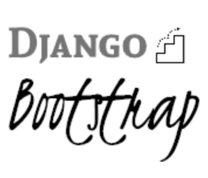

<!-- markdownlint-disable -->
<h1 align="center" style="margin:1em">
  
</h1>

<h4 align="center">
  Offer yourself a head start   for your next Django project
</h4>

  
  
  
  

 

### Looking for something lighter ?

- Like a bootstrap for a new flask project ? Check [Flask-Bootstrap](https://github.com/ebreton/flask-bootstrap)...
- Like a bootstrap for a new python project with a simple CLI ? Check [PyBootstrap](https://github.com/ebreton/pybootstrap)...

### Main features

- **Dev friendly**: a Makefile will allow to quickly setup everything with `make init-venv`
- **Automated** testing and deployment: connected to Travis and Codecov, relies on Docker for deployment.

#### Something is missing ?

Head to [githup issues](https://github.com/ebreton/django-bootstrap/issues) and submit one ! Be sure to have a look at the [CONTRIBUTING.md](./docs/CONTRIBUTING.md) guide before

### Install and Usage

Check out [INSTALL.md](./docs/INSTALL.md) for more details

### Changelog

All notable changes to this project are documented in [CHANGELOG.md](./docs/CHANGELOG.md).

### Contribution

Check out [CONTRIBUTING.md](./docs/CONTRIBUTING.md) for more details

As well as our [CODE_OF_CONDUCT.md](./docs/CODE_OF_CONDUCT.md), where we pledge to making participation in our project and our community a harassment-free experience for everyone
